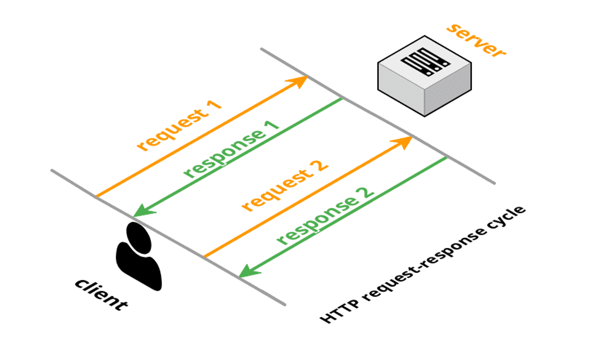
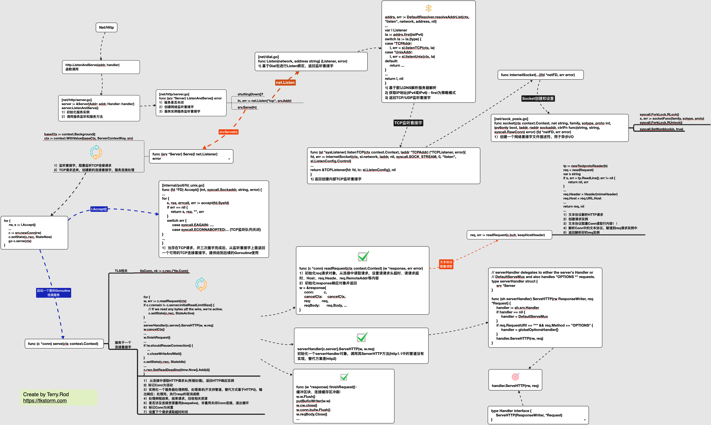

## Go-long-polling

A very simple demonstration of long-polling with AJAX (jQuery) and Golang. Long-polling makes near "real-time"
applications possible. The client does not request new data every X seconds/minutes, the client gets new data
delivered when there is new data (push-notification style). 

## What is long-polling (and short polling) ?

#### Short-polling

Send a request to the server, get an instant answer. Do this every x seconds, minutes etc. to keep your application
up-to-date. But: This costs a lot of requests.

#### Long-polling

Send a request to the server, keep the connection open, get an answer when there's "data" for you. This will cost you
only one request (per user), but the request keeps a permanent connection between client and server up.



## How to use

### Run Golang lyric Web Server
```
$ git clone https://github.com/tkstorm/go-long-polling.git
$ cd go-long-polling/
$ go run ./server/server.go -filename ./data.txt
2019/10/23 18:22:08 Listen on :9102...
2019/10/23 18:22:10 request count: 1
2019/10/23 18:22:10 request count: 2
2019/10/23 18:22:10 request count: 3
...
```

### Client
While having the index.html opened in your browser, each lyric request on one tcp connect(keepalive), long polling request the
lyric sentence.

You will see the interval specified time, will get the latest lyrics from the server!

```
Music Lyric:
[00:00.00] By Terry Rod

[00:00.21] 新的心跳-G.E.M.邓紫棋

[00:00.99] (真人秀《极速前进第二季》主题曲)

[00:01.54] 词：G.E.M.邓紫棋

[00:02.13] 曲：G.E.M.邓紫棋

[00:03.26]

[00:04.20] 也许你看过太多悲剧

[00:10.50] 也受过太多委屈

[00:14.07] 你怕不愿回首的过去
...
```

## This is just a simple example

### More about long polling

- https://stackshare.io/ablyrealtime/websockets-vs-long-polling
- https://github.com/jcuga/golongpoll?ref=stackshare
- Search HTTP/1.1 Pipeline, KeepAlive, HTTP/2 protocol

### About net/http handle flow
